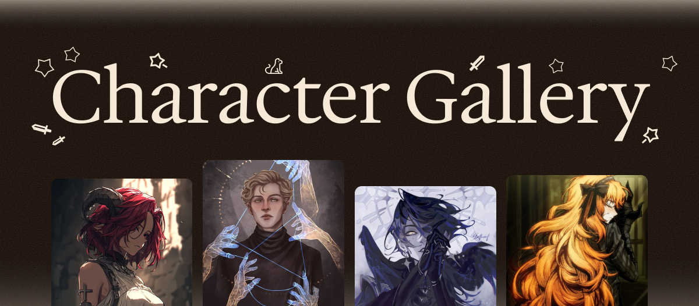
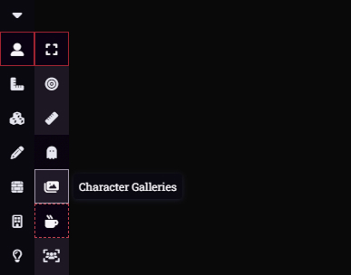

# 📸 Character Gallery

> Instagram for your D&D characters. Because "what does your character look like again?" is the most annoying question at the table.



## The Problem

Your barbarian got a sick new tattoo three sessions ago. Nobody remembers.

Your rogue changed their outfit after that heist. Everyone forgot.

Your wizard's pet familiar? Yeah, what color was that again?

**Sound familiar?**

## The Solution

Character Gallery turns every player character into their own Instagram profile. Upload images, share moments, show off your character's vibe. Your party will actually remember what everyone looks like. Revolutionary, right?



## Features

🎨 **Beautiful Interface** - Warm, elegant design that doesn't hurt your eyes at 2am.

🖼️ **Image Carousel** - Full-screen viewing with arrow navigation. Chef's kiss.

👥 **Everyone Can Browse** - Players can view any character's gallery.

📤 **Uploads** - Owners can add images easily.

## How To Use

### Installation

1. Open Foundry VTT
2. Go to Add-on Modules
3. Click "Install Module"
4. Paste this manifest URL:
```
   https://github.com/makileth/Character-Gallery/raw/main/module.json
```
5. Click Install
6. Enable the module in your world

### Using It

**Step 1:** Click the gallery button in your token controls (left sidebar)

**Step 2:** Pick any player character from the grid

**Step 3:** Browse their gallery, or upload your own images if it's your character

**Step 4:** Click any image to open the full-screen carousel viewer

## Perfect For

- Character outfit references
- Pet companions and mounts
- Campaign moments worth remembering
- Character evolution over time
- Sharing fan art

## Tech Stuff

- Built for Foundry VTT v13
- Uses actor flags for storage
- Lightweight and fast
- No external dependencies
- Clean, modern UI

## Support

Found a bug? Got an idea? 

[Open an issue on GitHub](https://github.com/makileth/Character-Gallery/issues)

## Credits

Made by [makileth](https://github.com/makileth) because forgetting character details is unacceptable.

## License

MIT - Do whatever you want with it. Just don't blame me if something breaks.

```
